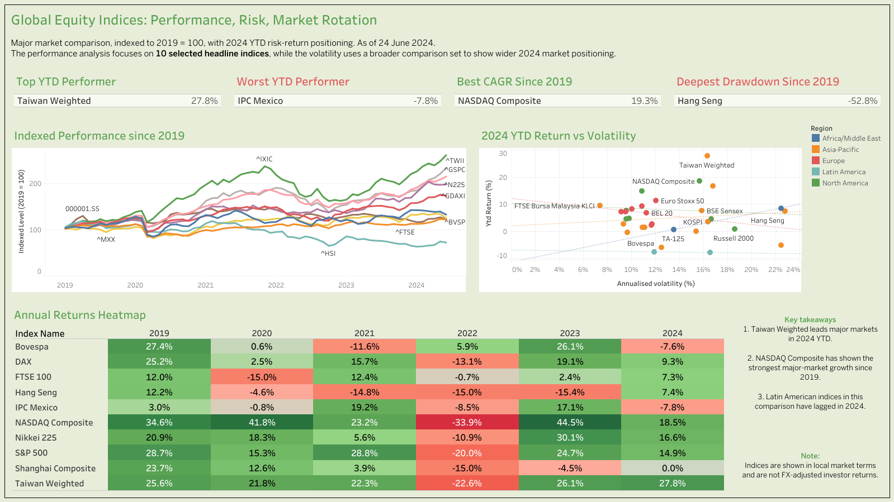

# Tableau-Global-Equity-Indicies
A Tableau dashboard exploring global equity index performance, 2024 YTD risk-return positioning, and annual market rotation across major benchmark indices.

## Overview

This project presents a Tableau dashboard analysing global equity index behaviour from 2019 to 24 June 2024. It brings together three perspectives in a single view:

- indexed performance since 2019
- 2024 year-to-date return versus annualised volatility
- annual returns by market

The dashboard was designed as a portfolio project with an emphasis on clarity, consistency, and business-facing storytelling.

## Dashboard Preview



[View the interactive dashboard on Tableau Public] (https://public.tableau.com/app/profile/daehurn/viz/GlobalEquityIndices/GlobalEquityIndicesPerformanceRiskMarketRotation?publish=yes)

## Project Objective

The aim of this dashboard is to provide a concise and visually accessible view of how major global equity markets have performed over time, how they compare on a risk-return basis in 2024, and how market leadership has shifted year by year.

This project was built to demonstrate data visualisation, dashboard design, filtering logic, and analytical storytelling in Tableau.

## Dashboard Contents

The dashboard includes:

KPI cards showing the top year-to-date performer, weakest year-to-date performer, best CAGR since 2019, and deepest drawdown since 2019
Indexed performance chart showing long-run performance rebased to 2019 = 100
Risk-return scatter plot comparing 2024 year-to-date return with annualised volatility
Annual returns heatmap showing how market performance has shifted from year to year
Insight panel summarising the main takeaways and methodological caveats

## Key Insights
Taiwan Weighted is the strongest major market in 2024 year-to-date terms.
NASDAQ Composite has shown the strongest major-market growth since 2019.
Latin American indices in this comparison have lagged in 2024.
Hang Seng shows the deepest drawdown among the selected headline indices.
Design Choices

To balance clarity and breadth, the dashboard uses two different analytical scopes.

The indexed performance chart and annual returns heatmap focus on 10 selected headline indices to support a cleaner long-run comparison:

S&P 500
NASDAQ Composite
Nikkei 225
FTSE 100
DAX
Hang Seng
Shanghai Composite
Taiwan Weighted
Bovespa
IPC Mexico

The 2024 year-to-date return versus volatility scatter plot uses a broader comparison set to provide wider market context for current-year positioning.

## Data Source

The underlying data comes from a Kaggle market indices dataset containing daily index-level data. The raw data was cleaned and reshaped into Tableau-ready CSV files for different analytical views.

Prepared files used in the dashboard include:
```
tableau_major_indices_daily.csv
tableau_index_summary.csv
tableau_yearly_returns.csv
```

## Tools Used
Tableau Public for dashboard development and publishing
CSV data preparation for shaping the dataset into analysis-ready inputs

```
Repository Structure
global-equity-indices-tableau-dashboard/
├── README.md
├── images/
│   └── dashboard_preview.png
├── pdf/
│   └── global_equity_indices_dashboard.pdf
├── data/
│   ├── tableau_major_indices_daily.csv
│   ├── tableau_index_summary.csv
│   └── tableau_yearly_returns.csv
└── docs/
    └── notes.md
```

Method Notes
Figures are shown as of 24 June 2024.
Indices are shown in local market terms and are not FX-adjusted investor returns.
The indexed performance and heatmap views focus on a selected set of headline indices for readability.
The volatility scatter uses a broader comparison set to show wider 2024 market positioning.
The dashboard excludes VIX from core equity comparison views because it is a volatility measure rather than a conventional equity benchmark.


You can explore the project in two ways:

View the interactive dashboard on Tableau Public
Open the exported PDF version included in this repository.
